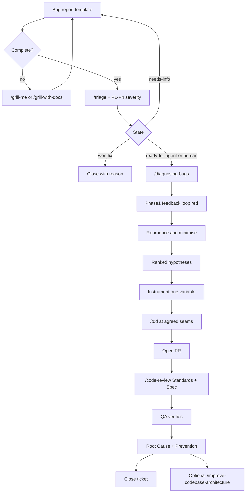

> **SUPERSEDED — Content Draft archived (Wave 3G).**  
> This file is historical teaching draft only — **not** the Living SOP or Published Course.  
> **Use instead:**
> - Living SOP: [`docs/reference/BUG-HANDLING-SOP.md`](../BUG-HANDLING-SOP.md)
> - Published Course: hub [`docs/index.html`](../../index.html) · Setup [`setup.html`](../../setup.html) · Modules [`module-1.html`](../../module-1.html)–[`module-5.html`](../../module-5.html)
> - Build / publish plan: [`docs/reference/BUILD-PLAN-D-STACK.md`](../BUILD-PLAN-D-STACK.md)
> - Workshop agenda: [`docs/reference/WORKSHOP-AGENDA.md`](../WORKSHOP-AGENDA.md)
>
> Do not treat P1–P4-as-impact, 4-module structure, or “Reproduce first” as top-level diagnosis steps from this draft as current law.

---

# Effective Bug Handling with Cursor & Matt Pocock Skills

**Document type:** In-depth course review draft (v0 — for rework)  
**Audience:** Mid-to-senior engineers on Practical AI teams using Cursor + [`mattpocock/skills`](https://github.com/mattpocock/skills)  
**Sources of truth for this draft:**
- Living SOP: [`docs/reference/BUG-HANDLING-SOP.md`](./BUG-HANDLING-SOP.md) (v1.0 Draft, 2026-07-16)
- Skills: [mattpocock/skills](https://github.com/mattpocock/skills) — especially `setup-matt-pocock-skills`, `diagnosing-bugs`, `tdd`, `triage`, `code-review`, `grill-me` / `grill-with-docs`, `implement`
- Peer research: [`docs/research/peer-bug-triage-sops.md`](../research/peer-bug-triage-sops.md)
- Live course today: 4 HTML modules under `docs/module-*.html` (~90–120 min)

> **Rework note for the next agent:** This file is a **rich content draft**, not the published course. The live site is still 4 modules per `AGENTS.md`. This review expands to a 5-module + reference program, deepens skill fidelity (especially `/diagnosing-bugs` Phase 1 “feedback loop first”), and surfaces SOP gaps to decide during rework. Do not treat section numbering here as a mandate to change Pages until product owners confirm.

---

## 1. Title Page / Cover

| Field | Value |
| --- | --- |
| **Course title** | Effective Bug Handling with Cursor & Matt Pocock Skills |
| **Subtitle** | Reproducibility → diagnosis → TDD → review → prevention |
| **Format** | Self-paced reading + workshop (~2.5–3.5 hours full program; can split) |
| **Prerequisites** | Cursor installed; ability to run tests locally; basic git/PR fluency |
| **Outcomes** | Ship bugs with a shared template, severity, skill loop, RCA + prevention |
| **Canonical process** | Living SOP (`BUG-HANDLING-SOP.md`) — course modules must stay aligned |
| **Skills installer** | `npx skills@latest add mattpocock/skills` then `/setup-matt-pocock-skills` |

### How to use this course

| Mode | How |
| --- | --- |
| **Self-paced** | Read modules in order; complete checklists and homework bugs |
| **Workshop** | Facilitator runs demos; pairs do exercises; close with E2E checklist |
| **Daily reference** | Sections 9–12 (workflow, pitfalls, metrics, quick reference) |

### Rework backlog (explicit)

Items the next agent should resolve before publishing as the “real” course:

1. **Module count:** SOP/HTML = 4 modules; this draft = 5 content modules + Setup. Decide whether to split diagnosis vs fix (as here) or keep combined Module 3.
2. **Severity model:** SOP uses P1–P4 (impact + urgency mixed). Peers often separate severity vs priority; decide whether to teach that nuance.
3. **Triage state machine:** Matt’s `/triage` uses `needs-triage` → `needs-info` → `ready-for-agent` / `ready-for-human` / `wontfix`. SOP currently teaches severity labels + assign. Merge language carefully.
4. **`/diagnosing-bugs` fidelity:** Live Module 3 lists “Reproduce” first; Matt’s skill leads with **Phase 1 — Build a feedback loop**. This draft follows Matt. Align SOP wording if adopted.
5. **Exercise fidelity:** Need portable sample bugs (not product-private BookIQ issues).
6. **Certification / completion:** Existing `certification.html` is light; decide depth.
7. **Slides/PDF:** See end of this document for conversion guidance.

---

## 2. Introduction & Why This Matters

### Learning objectives

- Explain the business cost of weak bug handling in concrete terms.
- Name the five core principles from the living SOP.
- Identify common failure modes this course is designed to prevent.

### Key concepts

**Bugs are a process problem as much as a code problem.** High-performing teams do not “try harder” — they standardize intake, force reproducibility, diagnose with a feedback loop, fix with tests, and close with learning.

#### Business impact

| Weak practice | What it costs |
| --- | --- |
| Vague reports | Hours of ping-pong; wrong person investigates; wrong severity |
| Fixing without repro | “Works on my machine” churn; regressions return next sprint |
| Skipping tests | Same class of bug ships twice; trust in CI erodes |
| Silent closure | No prevention; tribal knowledge dies with the fixer |
| Agent without skills | Verbose thrash, speculative patches, unreviewable diffs |

#### Common failure modes (teach these early)

1. **Symptom chasing** — patch the null check; miss the empty-state contract.
2. **Hypothesis-first debugging** — stare at code before a red-capable command exists.
3. **Horizontal TDD theater** — write twenty tests, then implement; tests encode imagined shape.
4. **Severity inflation / deflation** — everything is P1, or nothing is.
5. **Review as style nit** — miss Spec failures (wrong behavior) while arguing naming.
6. **No prevention note** — bug class repeats; metrics look “busy” not “improving.”

#### Core principles (from the living SOP — memorize)

1. **Reproducibility First** — if we cannot reliably reproduce it, we do not start fixing it.
2. **Skills-Driven** — major steps use Matt Pocock skills (`mattpocock/skills`).
3. **Documentation Discipline** — every ticket ends with **Root Cause** + **Prevention**.
4. **No Shortcuts** — TDD and code review are mandatory for production bugs.
5. **Continuous Improvement** — review the SOP quarterly.

### Motivational framing (workshop opener)

> We are not asking you to slow down. We are asking you to stop paying interest on the same bugs. A tight feedback loop, a failing test, and a one-paragraph prevention note are cheaper than a second outage.

### Self-check

- Can you recite the five principles without looking?
- Name one bug from your last quarter that would have been cheaper with a minimized repro + regression test.

---

## 3. Setup: Installing and Configuring Matt Pocock Skills

### Learning objectives

- Install the skills pack into Cursor (and optionally other agents).
- Run `/setup-matt-pocock-skills` once per repo and know what files it creates.
- Know which skills are **user-invoked** vs **model-invoked** for bug work.

### Exact install commands

**Preferred (skills.sh — editable copies in the project):**

```bash
npx skills@latest add mattpocock/skills
```

During install:

1. Select the skills you need (at minimum the bug-handling set below).
2. Select Cursor as a target agent.
3. **Ensure you select `/setup-matt-pocock-skills`.**

**Claude Code plugin path (managed bundle):**

```bash
claude plugin marketplace add mattpocock/skills
claude plugin install mattpocock-skills@mattpocock
```

Then still run `/setup-matt-pocock-skills` once per repo.

### Run `/setup-matt-pocock-skills`

This skill is **prompt-driven**, not a silent script. It will:

1. Explore the repo (`git remote`, `AGENTS.md` / `CLAUDE.md`, existing `docs/agents/`, triage skill presence).
2. Ask (with recommended defaults):
   - **Issue tracker** — GitHub / GitLab / local markdown / other
   - **Triage label vocabulary** — defaults: `needs-triage`, `needs-info`, `ready-for-agent`, `ready-for-human`, `wontfix`
   - **Domain docs layout** — usually single-context `CONTEXT.md` + `docs/adr/`
3. Write / update:
   - `docs/agents/issue-tracker.md`
   - `docs/agents/triage-labels.md` (if triage installed)
   - `docs/agents/domain.md`
   - An `## Agent skills` block in `AGENTS.md` or `CLAUDE.md`

**Team default for Practical AI product repos:** GitHub Issues via `gh`, with triage labels aligned to Matt’s canonical roles (map SOP severity labels alongside, do not replace them blindly).

### Skills cheat sheet for this course

| Skill | Invoke | Role in bug handling |
| --- | --- | --- |
| `/setup-matt-pocock-skills` | User | One-time repo configuration |
| `/grill-me` | User | Clarify vague plans/reports (general) |
| `/grill-with-docs` | User | Grill + sharpen domain model / ADRs / `CONTEXT.md` |
| `/triage` | User | State machine: categorize, verify, brief, route |
| `/diagnosing-bugs` | Model or user | Hard-bug diagnosis loop |
| `/tdd` | Model or user | Red → green vertical slices at agreed seams |
| `/code-review` | Model or user | Parallel **Standards** + **Spec** review |
| `/implement` | User | Build from tickets with `/tdd`, finish with `/code-review` |
| `/grilling` | Model | Reusable interview loop behind grill skills |
| `/domain-modeling` | Model | Shared language; used with grill-with-docs / triage |
| `/improve-codebase-architecture` | User | After fix: deepen seams that blocked good regression tests |
| `/ask-matt` | User | Router — “which skill should I use?” |

### Live demo / exercise

1. In a throwaway or training clone, run the installer.
2. Run `/setup-matt-pocock-skills` and accept GitHub defaults.
3. Confirm `docs/agents/issue-tracker.md` exists and points at the correct repo.
4. Type `/ask-matt` and ask: “I have a flaky production bug with no clear STR — which skill?”

### Setup checklist

- [ ] `npx skills@latest add mattpocock/skills` completed for Cursor
- [ ] `/setup-matt-pocock-skills` run for the working repo
- [ ] Issue tracker doc present and accurate
- [ ] Team knows severity labels (SOP) **and** triage state labels (Matt) — see Module 2
- [ ] Engineers can invoke `/diagnosing-bugs`, `/tdd`, `/code-review`, `/grill-with-docs`

---

## 4. Module 1: Bug Reporting Standards

### Learning objectives

- File a complete bug using the mandatory template without prompting.
- Distinguish a weak report from an actionable one.
- Use `/grill-me` or `/grill-with-docs` when the reporter’s story is incomplete.

### Key concepts

**Incomplete tickets get returned.** Reporting is not optional polish — it is the first feedback loop.

### Mandatory template (living SOP §3)

```markdown
**Title:** [Clear, concise description]

**Environment**
- Browser / OS / Version:
- Backend / API version:
- User role / permissions:
- Other relevant context (device, network, etc.):

**Reproduction Steps**
1.
2.
3.

**Expected Behavior**
[What should happen]

**Actual Behavior**
[What actually happens]

**Logs / Screenshots / Video**
[Attach or link here]

**Business / User Impact**
[Who is affected and how severely]
```

Teaching copy also lives at [`.github/ISSUE_TEMPLATE/bug-report.md`](../../.github/ISSUE_TEMPLATE/bug-report.md).

### Tips for great reports

- Make reproduction steps as **short and reliable** as possible.
- Include **before / after** states when relevant.
- Prefer a screen recording with timestamps over a novel-length narrative.
- Capture one failing API payload or console error when available.
- Title format that helps triage: `[Area] verb + failure` — e.g. `[Checkout] Submit disabled after coupon apply`.

### Weak vs strong examples

#### Weak (do not accept)

> Dashboard is broken on mobile sometimes. Customers are complaining.

#### Strong (accept)

```markdown
**Title:** [Dashboard] KPI cards blank on iOS Safari after refresh

**Environment**
- Browser / OS / Version: iOS 18.2, Safari; also reproducible in iPhone 15 Simulator
- Backend / API version: api v2.14.1 (staging + prod)
- User role / permissions: Org Admin
- Other: Wi-Fi only; does not reproduce on desktop Chrome 126

**Reproduction Steps**
1. Sign in as Org Admin on iPhone Safari.
2. Open Dashboard → Overview.
3. Pull to refresh (or hard-reload).
4. Observe KPI card row.

**Expected Behavior**
KPI cards show revenue, active users, and open tickets with numbers.

**Actual Behavior**
Cards render with labels but values stay “—” indefinitely. Network tab shows `/api/metrics/summary` returning 200 with body `{ "error": "timezone_offset_invalid" }` after refresh (first load is fine).

**Logs / Screenshots / Video**
- HAR attached; console screenshot of fetch error
- Loom: https://example.invalid/loom/kpi-blank

**Business / User Impact**
Org Admins cannot trust daily metrics on mobile (~30% of admin sessions). Support tickets rising; not a full outage.
```

### Using grill skills on reports

| Situation | Skill | Why |
| --- | --- | --- |
| Reporter is a human with incomplete STR | `/grill-me` | Relentless Q&A until branches resolve |
| Ambiguity involves domain terms / product language | `/grill-with-docs` | Same grilling + updates `CONTEXT.md` / ADRs via `/domain-modeling` |
| Triage already running | `/triage` (verify + grill if needed) | Built-in path to `/grilling` + domain modeling |

**Workshop prompt:** Facilitator plays a vague reporter. Engineer may only ask questions via a grill session — no codebase diving until the template is complete.

### Live demo / exercise

1. Rewrite the weak mobile dashboard report into the mandatory template (individually, 8 minutes).
2. Pair: one person is reporter with a secret “real” bug; the other must complete the template using `/grill-me` style questions (even offline as a checklist).
3. Peer review: mark any missing section with a red pen / comment; return incomplete tickets.

### Module 1 checklist

- [ ] I can list every required template section from memory
- [ ] I rewrote at least one weak report into a strong one
- [ ] I know when to invoke `/grill-me` vs `/grill-with-docs`
- [ ] I will return incomplete tickets instead of guessing

---

## 5. Module 2: Triage Process

### Learning objectives

- Apply P1–P4 severity with correct triage SLAs.
- Route bugs using labels, ownership, and Matt’s `/triage` state machine.
- Verify claims (reproduce or needs-info) before declaring work ready.

### Key concepts

Triage is **confirmation + routing**, not “add a label and hope.” Peer SOPs (Kubernetes, Chromium, GitLab, Mozilla) agree: reproduce/clarify first, then accept into a work queue.

### Severity levels (living SOP §4)

| Level | Meaning | Triage SLA |
| --- | --- | --- |
| **P1 Blocker** | Production outage, security issue, or blocks core user flows | Within **1 hour** |
| **P2 Major** | Significant functionality broken for many users | Within **4 hours** |
| **P3 Minor** | Limited users or non-critical paths | Normal backlog cadence |
| **P4 Cosmetic** | Visual glitches, typos, low-impact UX | When capacity allows |

**Calibration tip (from peer research):** when unsure between two severities, **overestimate briefly**, then confirm with a domain expert — do not leave hot bugs under-labeled.

**Rework decision:** consider teaching **severity (impact) ≠ priority (scheduling)** later; v1 SOP mixes them into P1–P4 — teach P-scale as-is until SOP changes.

### SOP triage steps

1. Apply severity label (P1–P4).
2. Add component/area labels (`auth`, `dashboard`, `mobile`, …).
3. Assign to a developer or move to **Backlog**.
4. Use `/triage` where available.

### Matt `/triage` state machine (teach alongside severity)

Category roles (exactly one):

- `bug`
- `enhancement`

State roles (exactly one):

| State | Meaning |
| --- | --- |
| `needs-triage` | Maintainer must evaluate |
| `needs-info` | Waiting on reporter |
| `ready-for-agent` | Fully specified; agent-ready brief attached |
| `ready-for-human` | Needs human judgment / access / design |
| `wontfix` | Will not action (with reason) |

**Typical flow for a bug:**

```text
unlabeled → needs-triage → (verify repro)
    ├─ needs-info ⇄ needs-triage
    ├─ ready-for-agent  (+ agent brief)
    ├─ ready-for-human  (+ human brief)
    └─ wontfix          (duplicate / already implemented / rejected)
```

**AI disclaimer:** every comment posted during Matt’s triage skill must start with:

```markdown
> *This was generated by AI during triage.*
```

### Triage a specific issue (skill procedure — condensed)

1. **Gather context** — body, comments, labels; search for redundancy and prior rejection (`.out-of-scope/`).
2. **Recommend** category + state; wait for maintainer direction when ambiguous.
3. **Verify the claim** — for bugs: reproduce from STR. Outcomes: confirmed / failed / insufficient detail.
4. **Grill if needed** — `/grilling` + `/domain-modeling`.
5. **Apply outcome** — including agent brief for `ready-for-agent` (see skill’s `AGENT-BRIEF.md`).

**Needs-info template:**

```markdown
## Triage Notes

**What we've established so far:**

- point 1
- point 2

**What we still need from you (@reporter):**

- question 1
- question 2
```

### Severity calibration exercise (workshop)

Assign P1–P4 (and propose triage state) to each:

| Scenario | Suggested answer (facilitator key) |
| --- | --- |
| Login 500s for all users in prod | P1; `needs-triage` → verify → `ready-for-human` or agent with brief |
| CSV export wrong column order for one enterprise tenant | P2 or P3 depending on blast radius; often `needs-info` for sample file |
| Typo on settings empty state | P4 |
| XSS in shared comment field | P1 + **private security path** (not public issue chatter) |
| “App feels slow sometimes” with no metrics | Do not severity-guess — `needs-info` first |

### Security routing (gap to teach lightly)

Security issues that are P1 by impact should still use **private disclosure / advisories** where the org has a `SECURITY.md` or private reporting — do not paste exploit details into public issues.

### Module 2 checklist

- [ ] I can distinguish P1 vs P2 vs P3 vs P4 and state P1/P2 SLAs
- [ ] I can name the five triage state roles
- [ ] I verified (or explicitly marked needs-info) before ready-for-*
- [ ] I add component labels and an owner or backlog placement

---

## 6. Module 3: Diagnosis Mastery

### Learning objectives

- Run `/diagnosing-bugs` without skipping phases unless explicitly justified.
- Build a **tight, red-capable, agent-runnable** feedback loop before hypothesizing.
- Produce 3–5 falsifiable, ranked hypotheses and instrument one variable at a time.

### Hard truth

> Diagnosis without a minimized reproduction is guessing. Jumping to a theory before a red-capable command exists is the failure mode this skill exists to prevent.

### Skill deep dive: `/diagnosing-bugs` (six phases)

Read `CONTEXT.md` and relevant ADRs before exploring.

#### Phase 1 — Build a feedback loop (**this is the skill**)

Spend disproportionate effort here. Goal: **one command** you have already run, that:

- [ ] Is **red-capable** — asserts the user’s exact symptom (not merely “didn’t crash”)
- [ ] Is **deterministic** (or high repro rate for flakes)
- [ ] Is **fast** — seconds, not minutes
- [ ] Is **agent-runnable** (HITL only via structured harness if humans must click)

**Ways to construct a loop (try roughly in order):**

1. Failing test at a seam that reaches the bug  
2. Curl / HTTP script against a running server  
3. CLI + fixture, diff stdout vs known-good  
4. Headless browser (Playwright / Puppeteer)  
5. Replay a captured trace / payload  
6. Throwaway harness with mocked deps  
7. Property / fuzz loop for intermittent wrong output  
8. Bisection harness for `git bisect run`  
9. Differential loop (old vs new version)  
10. HITL bash script (last resort)

**Tighten:** faster, sharper assertion, more deterministic. A 30s flaky loop ≈ useless; a 2s deterministic loop is a superpower.

**If you cannot build a loop:** stop. List attempts. Ask for env access, artifacts (HAR, logs, recording), or permission for temporary prod instrumentation. **Do not proceed to Phase 3 without a loop.**

#### Phase 2 — Reproduce + minimise

- Confirm the loop shows the **user’s** failure mode (wrong bug = wrong fix).
- Shrink until every remaining element is load-bearing.

#### Phase 3 — Hypothesise

- Generate **3–5 ranked, falsifiable** hypotheses **before** testing any.
- Format: *If X is the cause, then Y will make the bug disappear / worsen.*
- Show the ranked list to the user (cheap checkpoint). Don’t block forever if AFK.

#### Phase 4 — Instrument

- Each probe maps to a prediction.
- Prefer debugger/REPL → targeted logs → never “log everything.”
- Tag logs with a unique prefix e.g. `[DEBUG-a4f2]` for cleanup.
- Perf bugs: **measure first** (baseline), then bisect — logs are usually wrong.

#### Phase 5 — Fix + regression test

- Prefer writing the regression test **before** the fix when a **correct seam** exists.
- Correct seam = exercises the real bug pattern at the call site.
- If no correct seam: document that finding; architecture may need `/improve-codebase-architecture` after the fix.
- After fix: re-run the **original** Phase 1 loop (un-minimised scenario).

#### Phase 6 — Cleanup + post-mortem

- [ ] Original repro green  
- [ ] Regression test passes (or seam absence documented)  
- [ ] Debug instrumentation removed  
- [ ] Throwaway harnesses deleted or quarantined  
- [ ] Correct hypothesis stated in PR/commit  
- [ ] Ask: what would have prevented this? Hand architectural follow-ups to `/improve-codebase-architecture`

### Mapping SOP wording ↔ Matt phases

| SOP short list (current HTML) | Matt phase |
| --- | --- |
| Reproduce | Phase 2 (after loop exists) |
| Minimize | Phase 2 |
| Hypothesize | Phase 3 |
| Instrument | Phase 4 |
| Fix | Phase 5 |
| Regression test | Phase 5–6 |
| *(missing in short list)* | **Phase 1 feedback loop** |

**Recommendation for rework:** update living SOP §5 and Module 3 HTML to lead with Phase 1.

### Live demo (facilitator)

Demo a known training bug end-to-end through Phase 3 only:

1. Narrate refusal to open production code until a red command exists.
2. Show a failing test or curl going red.
3. Minimise inputs live.
4. Write 3–5 hypotheses on a whiteboard; invite re-ranking from the room.
5. Stop before the fix — hand off to Module 4.

### Paired exercise

Pick a sample bug (homework set in §13). Out loud, complete:

1. Name the Phase 1 command you will build.  
2. Minimise criteria.  
3. Ranked hypotheses.  
4. Where the first regression test would live (seam).  

**Rule:** no fix code until partner agrees Phases 1–3 are honest.

### Module 3 checklist

- [ ] I can explain why Phase 1 precedes hypotheses
- [ ] I can list the six phases in order
- [ ] I know stop conditions when a loop cannot be built
- [ ] I walked a sample bug through hypothesize before fixing

---

## 7. Module 4: Fixing Bugs the Right Way

### Learning objectives

- Fix production bugs with `/tdd` at **pre-agreed seams**.
- Prefer vertical slices (tracer bullets) over horizontal test dumps.
- Use `/implement` when working from a triaged brief / ticket set.

### Hard truth

> TDD without a failing test first is theater. Tests coupled to internals are liabilities.

### `/tdd` — rules that matter for bug fixes

**What a good test is**

- Verifies **behavior through public interfaces**
- Reads like a specification (“user can checkout with valid cart”)
- Survives refactors

**Seams**

- A seam is the public boundary you observe without reaching inside.
- **Before writing any test**, write down the seams and confirm with the human.
- No test at an unconfirmed seam.

**Anti-patterns**

| Anti-pattern | Tell |
| --- | --- |
| Implementation-coupled | Breaks on refactor with unchanged behavior; mocks internals |
| Tautological | Assertion recomputes the same way as the code |
| Horizontal slicing | All tests first, then all implementation |

**Rules of the loop**

1. **Red before green** — failing test first; only enough code to pass.  
2. **One slice at a time** — one seam, one test, one minimal implementation.  
3. **Refactoring is not part of the red→green loop** — belongs with `/code-review` stage.

### Recommended fix workflow (SOP §5 + skills)

1. Acknowledge ticket; set **In Progress**.
2. Finish `/diagnosing-bugs` through a clear root hypothesis (Module 3).
3. Agree seams for regression coverage.
4. Run `/tdd` (or `/implement` which drives `/tdd`):
   - Turn minimised repro into failing test at the seam.
   - Watch red → implement → watch green.
   - Re-run original Phase 1 loop.
5. Document findings in the ticket (partial notes OK before PR).

### Vertical slicing for bugs (mental model)

```text
Slice 1: failing test for exact symptom at seam A → minimal fix
Slice 2: adjacent edge case that the diagnosis revealed → minimal fix
Stop when original loop is green and prevention note is draftable
```

Do **not** “while we’re here” rewrite the module — park deepening in a follow-up ticket / `/improve-codebase-architecture`.

### Live demo / exercise

- Continue the Module 3 sample: write the failing regression test first; only then apply the fix.
- Code review your own test against the anti-pattern table before opening a PR.

### Module 4 checklist

- [ ] Seams confirmed with a human before tests
- [ ] Saw the test fail for the right reason
- [ ] Fix is minimal and hypothesis-aligned
- [ ] Original (un-minimised) loop is green
- [ ] No speculative refactors bundled into the bug PR

---

## 8. Module 5: Review, Prevention & Closure

### Learning objectives

- Run `/code-review` as a **two-axis** review (Standards vs Spec).
- Close every production bug with Root Cause + Prevention.
- Know when ticket notes are enough vs when a lightweight postmortem is warranted.

### Closure workflow (living SOP §6)

1. Open PR with clear description referencing the ticket.  
2. Run `/code-review`.  
3. Address feedback.  
4. Update the ticket with:
   - **Root Cause:** detailed explanation  
   - **Prevention:** what stops this class of bug next time  
5. QA verifies fix.  
6. Close ticket and PR.

### `/code-review` — two axes (do not merge findings)

| Axis | Question |
| --- | --- |
| **Standards** | Does the diff follow repo coding standards + Fowler smell baseline (judgement calls)? |
| **Spec** | Does the diff faithfully implement the originating issue / PRD? |

Process essentials:

1. Pin a fixed point (`main`, merge-base, SHA). Confirm non-empty three-dot diff.  
2. Identify spec source (issue refs in commits, path, PRD).  
3. Identify standards sources (`CODING_STANDARDS.md`, `CONTRIBUTING.md`, etc.).  
4. Spawn **parallel** Standards and Spec sub-agents.  
5. Aggregate under separate headings; one-line summary per axis — **never rerank across axes**.

Why two axes matter for bugs:

- Clean code that fixes the wrong symptom → Standards pass, Spec fail.  
- Exact fix that ignores project conventions → Spec pass, Standards fail.

### Root cause + prevention template

```markdown
## Closure

**Root Cause:**
[Mechanism — what broke and why. Not “null pointer.” Prefer: “timezone offset from Safari was sent as `undefined` after refresh; server rejected; UI treated error body as empty metrics.”]

**Prevention:**
- [ ] Regression test at seam: …
- [ ] Guard / validation: …
- [ ] Docs / CONTEXT.md term clarified: …
- [ ] Follow-up architecture ticket (if seam missing): …
```

### When to go beyond ticket notes (peer-informed)

Consider a short blameless postmortem (separate doc) when:

- User-visible outage / data loss  
- P1 security event  
- On-call intervention required  
- Long time-to-mitigate  
- Monitoring failed to detect  

Otherwise: ticket RCA + prevention is the default (SOP).

### Live demo / exercise

1. Run `/code-review` against a training PR; force the room to classify each finding as Standards or Spec.  
2. Write a prevention note for a past painful bug in one sentence, then expand to three concrete actions.

### Module 5 checklist

- [ ] PR references ticket and states the winning hypothesis  
- [ ] `/code-review` run with explicit fixed point  
- [ ] Root Cause + Prevention on the ticket  
- [ ] QA verified before close  
- [ ] Architectural follow-ups filed separately when needed

---

## 9. Full End-to-End Workflow

### Visual diagram



### Skill sequence (cheat path)

```text
Report → (/grill-*) → /triage → /diagnosing-bugs → /tdd → PR → /code-review → QA → RCA/Prevention → Close
         optional                (/implement wraps tdd + code-review for ticketed work)
```

### End-to-end checklist (print this)

**Intake**

- [ ] Template complete (env, STR, expected/actual, evidence, impact)  
- [ ] Incomplete → returned or grilled — not guessed  

**Triage**

- [ ] Severity P1–P4 + component labels  
- [ ] Triage state role applied  
- [ ] Claim verified or needs-info  
- [ ] Agent/human brief if ready-for-*  

**Diagnosis**

- [ ] Phase 1 red-capable command recorded  
- [ ] Minimised repro  
- [ ] 3–5 falsifiable hypotheses ranked  
- [ ] Instrumentation cleaned up later  

**Fix**

- [ ] Seams agreed  
- [ ] Failing regression test first (when seam exists)  
- [ ] Minimal fix; original loop green  

**Review & close**

- [ ] `/code-review` both axes  
- [ ] QA verified  
- [ ] Root Cause + Prevention on ticket  
- [ ] Follow-ups filed  

---

## 10. Common Pitfalls & How to Avoid Them

| Pitfall | Why it hurts | Avoidance |
| --- | --- | --- |
| Fixing without repro | Wrong fix, recurring incidents | Reproducibility First; `/diagnosing-bugs` stop rule |
| Hypothesis before feedback loop | Anchoring + wasted instrumentation | Phase 1 completion criteria |
| “Works on my machine” only | Misses env-specific bugs | Capture env in template; loop must match reporter symptom |
| Logging everything | Noise; leftover logs in prod | Tagged `[DEBUG-…]` probes; one variable at a time |
| Horizontal TDD | Brittle imagined tests | Vertical slices; confirm seams |
| Bundling refactors into bugfix | Risky PR; review fog | Separate tickets; review stage for refactors |
| Severity theater | Alert fatigue or ignored fires | Calibration exercises; overestimate then confirm |
| Skipping Spec axis in review | Ship wrong behavior cleanly | Always run both `/code-review` axes |
| Closing without prevention | Same bug class returns | Mandatory RCA + Prevention section |
| Public security details | Increases risk | Private disclosure path |
| Agent thrash without skills | Token burn, incoherent diffs | Invoke the right skill; `/ask-matt` when unsure |
| Treating flaky 1% repro as done | Undebuggable | Raise repro rate before hypothesizing |

---

## 11. Metrics & Continuous Improvement

### Metrics to track (living SOP §9)

| Metric | Why |
| --- | --- |
| Avg time report → fix (by severity) | Velocity + SLA reality |
| % bugs with reproduction steps | Intake quality |
| % fixes with regression tests | Prevention muscle |
| Recurring bug rate | Are prevention notes working? |
| Team feedback on process | SOP fitness |

### Cadence

| Ritual | Cadence | Owner |
| --- | --- | --- |
| Engineer: 1–2 bugs following full process | Post-training | Each engineer |
| Bug process retro | Monthly | Eng lead |
| Living SOP review | Quarterly | Team lead + EM |
| Severity calibration workshop | Semi-annual or after major miss | Facilitator |

### Continuous improvement prompts

- Which Phase 1 loop patterns should be templates in the repo (`scripts/repro/`)?  
- Where did we lack a test seam? File architecture work.  
- Are P1/P2 triage SLAs actually met? If not, fix staffing/routing — not the metric definition alone.

### Rework note — possible SOP additions (from peer research)

Not in living SOP yet; decide during rework:

- Explicit confirmation gate (`needs-triage` → accepted)  
- Needs-info timeout / stale policy  
- Lightweight resolution SLO for P1/P2  
- Regression label  
- Postmortem trigger list for outage-class events  

---

## 12. Resources & Quick Reference

### Canonical links

| Resource | Location |
| --- | --- |
| Living SOP | [`docs/reference/BUG-HANDLING-SOP.md`](./BUG-HANDLING-SOP.md) |
| Teaching issue template | [`.github/ISSUE_TEMPLATE/bug-report.md`](../../.github/ISSUE_TEMPLATE/bug-report.md) |
| Live course (current 4-module) | https://practical-office.github.io/bug-handling-sop/ |
| Local preview | `cd docs && python3 -m http.server 4174` |
| Matt skills repo | https://github.com/mattpocock/skills |
| Peer triage research | [`docs/research/peer-bug-triage-sops.md`](../research/peer-bug-triage-sops.md) |

### Skill cheat sheet (invoke lines)

```text
/setup-matt-pocock-skills     # once per repo
/grill-me                     # clarify vague report/plan
/grill-with-docs              # clarify + domain docs
/triage                       # route & verify issues
/diagnosing-bugs              # hard bug / perf loop
/tdd                          # red → green at seams
/implement                    # tickets → tdd → code-review
/code-review                  # Standards ‖ Spec
/ask-matt                     # which skill?
/improve-codebase-architecture  # after fix if seams were wrong
```

### One-page severity card

| P | Meaning | Triage |
| --- | --- | --- |
| P1 | Outage / security / core blocked | ≤ 1h |
| P2 | Major, many users | ≤ 4h |
| P3 | Limited / non-critical | Backlog |
| P4 | Cosmetic | Capacity |

### Closure card

```markdown
**Root Cause:** …
**Prevention:** …
```

### Further reading

- Matt Pocock — *Skills For Real Engineers* README (failure modes #1–#4)  
- Google SRE — Postmortem Culture; Managing Incidents  
- GitLab Handbook — Issue Triage  
- Kent Beck — TDD; Fowler — Refactoring (smell baseline used by `/code-review`)  
- Ousterhout — *A Philosophy of Software Design* (deep modules / seams)

---

## 13. Exercises & Homework

### Exercise A — Report rewrite (Module 1)

**Input:** “Payments flaky for some customers since Tuesday.”

**Deliverable:** Full mandatory template. Invent plausible but consistent env/STR/evidence. Mark assumptions with `ASSUMPTION:`.

### Exercise B — Severity + triage state (Module 2)

For each, assign P-level + triage state + next action:

1. Prod checkout 500 for all cards  
2. Dark mode contrast fail on secondary button  
3. Search results omit hyphenated SKUs for one catalog  
4. Reporter claims “data loss” with no STR  

### Exercise C — Diagnosis dry-run (Module 3)

**Sample bug (portable, fictional):**

> In a Node API, `GET /v1/invoices?asOf=2026-07-16` returns 200 with an empty list when the client’s `Accept-Timezone` header is present. Without the header, invoices return correctly. Started after a “timezone normalization” PR.

**Deliverable:**

1. Propose a Phase 1 command (test or curl).  
2. Minimisation plan.  
3. Five ranked falsifiable hypotheses.  
4. First instrumentation probe for hypothesis #1.  
5. Seam proposal for the regression test.

**Rule:** no production fix code in this exercise.

### Exercise D — Red → green (Module 4)

Using Exercise C’s seam: write a failing test sketch (pseudo-code OK) that asserts the user’s symptom, then outline the minimal fix in ≤5 lines of prose.

### Exercise E — Two-axis review (Module 5)

Given a fictional PR description: “Fixed empty invoices by removing Accept-Timezone support globally.”

List:

- Spec findings (vs the bug: header should be honored, not removed)  
- Standards findings (speculative generality / shotgun surgery if many call sites changed)

### Exercise F — Full homework (post-course)

Each engineer completes **1–2 real bugs** following the E2E checklist (§9). Paste the Phase 1 command and the Prevention note into the ticket. Bring both to the monthly retro.

### Facilitator key (short)

| Exercise | Pass criteria |
| --- | --- |
| A | All template sections present; STR ≤ 6 steps; impact specific |
| B | P1 for (1); P4 for (2); P2/P3 reasoned for (3); needs-info for (4) |
| C | Phase 1 named; ≥3 falsifiable hypotheses; seam stated |
| D | Test would fail before fix; fix matches winning hypothesis |
| E | At least one Spec fail on “remove header globally” |
| F | Ticket shows RCA + Prevention + regression evidence |

---

## Appendix A — Workshop agenda (≈ 3 hours)

| Block | Time | Content |
| --- | --- | --- |
| 0 | 15m | Setup verification + principles |
| 1 | 25m | Reporting + grill exercise |
| 2 | 25m | Triage calibration |
| 3 | 45m | Diagnosis demo + paired dry-run |
| 4 | 30m | TDD fix demo |
| 5 | 25m | Code review + closure writing |
| 6 | 15m | E2E checklist + homework |

Shorter 90–120m cut: keep principles, Module 1–2 light, deep Module 3, skim 4–5 (matches current SOP outline).

---

## Appendix B — Turning this into slides or PDF

### PDF (fast path)

1. Convert this Markdown with your preferred toolchain (`pandoc`, Typora, VS Code “Markdown PDF”, or Quarto).  
2. Or: after rework lands in HTML, open `docs/course-full.html` → Print → Save as PDF (current site path).

Suggested `pandoc`:

```bash
pandoc docs/reference/review001.md -o bug-handling-course.pdf \
  --from markdown --pdf-engine=xelatex \
  -V geometry:margin=1in \
  --toc --toc-depth=2
```

### PowerPoint / Keynote

**Structure:** one slide deck section per major heading (§2–§13). Within each module:

1. Title + learning objectives (1 slide)  
2. Key concepts (1–2 slides)  
3. Process / diagram (1 slide)  
4. Example or demo prompt (1 slide)  
5. Checklist (1 slide)

**Slide economy rules:**

- Paste templates as monospace slides; don’t shrink 40-line blocks — split.  
- Mermaid E2E diagram → export SVG from mermaid.live or recreate with 6–7 boxes max.  
- Pitfalls → one pitfall per slide or a two-column table slide.  
- Facilitator keys stay in speaker notes, not on-screen.

**Tools:** Marp / Slidev (Markdown-native), or Pandoc → pptx:

```bash
pandoc docs/reference/review001.md -o bug-handling-course.pptx
```

Expect heavy cleanup after Pandoc PPTX; prefer Marp if you want MD → slides with less thrash.

### What the next agent should produce after rework

1. A decided module map (4 vs 5) reflected in SOP + HTML.  
2. Updated `/diagnosing-bugs` Phase 1 language in living SOP.  
3. Portable exercise fixtures (or a tiny training repo).  
4. Published Pages content + printable `course-full`.  
5. Close or update wayfinder grilling tickets (#2 Module 3 split, #3 Module 2 examples, #4 certification, #6 next iteration).

---

## Appendix C — Source fidelity notes (for rework QA)

| Claim in this draft | Source |
| --- | --- |
| Reproducibility first; RCA + Prevention; TDD + review mandatory | Living SOP §§2, 5, 6 |
| P1 1h / P2 4h triage | Living SOP §4 |
| Install via `npx skills@latest add mattpocock/skills` | Matt README + SOP §7 |
| `/setup-matt-pocock-skills` writes `docs/agents/*` | setup skill SKILL.md |
| Diagnosis Phase 1 = feedback loop first | diagnosing-bugs SKILL.md |
| TDD seams + anti-patterns + no refactor in loop | tdd SKILL.md |
| Triage roles + verify before brief | triage SKILL.md |
| Code review Standards ‖ Spec parallel agents | code-review SKILL.md |
| `/implement` drives tdd then code-review | implement SKILL.md |
| Severity≠priority, needs-info timeouts, postmortem triggers | peer research (consider, not yet SOP law) |

---

**End of review001 draft.**  
Next agent: treat this as the content spine; reconcile with `AGENTS.md` 4-module constraint or explicitly graduate the course to this expanded map.
```
