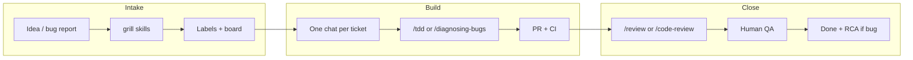

# Practical AI — Systems & Operations Analysis

**Date:** 2026-07-17  
**Audience:** Engineering leads, ops, Cursor-first builders  
**Primary evidence:** `Practical-Office/bug-handling-sop` (this repo), org Projects, plus read-only inspection of product trackers (`Book-IQ/bookiqv1-rc`), sibling onboarding (`bml-onboarding`), and skills process docs (`cursor-skills` AI Development SOP).  
**Not in scope for edits from this workspace:** BookIQ product code, ledger, or live product issues (per repo doctrine). Recommendations for product repos are proposals only.

---

## 1. Executive summary

Practical AI already has a **strong process story** for shipping AI-assisted product work and for handling bugs — but the story is **split across repos**, only **partially enforced on GitHub**, and uneven for **juniors / new hires**.

| Layer | What exists today | Business impact |
| --- | --- | --- |
| **Feature delivery** | Seven-phase AI Development SOP (Idea → Research → Prototype → PRD → Kanban → Execution → QA) in `cursor-skills` | Clear path from idea to verified slice; AFK-friendly via `ready-for-agent` |
| **Bug handling** | Living Bug Handling SOP v2.0 + Five-Module course + Exercise Lab | Reproducibility, Severity≠Priority, TDD + two-axis review, RCA+Prevention |
| **Product engineering** | `Book-IQ/bookiqv1-rc` monorepo, team labels, CI/deploy workflows, org rulesets, CODEOWNERS | Real shipping capacity for BookIQ accounting/automation |
| **Team work visibility** | Org Projects: [Bug Report](https://github.com/orgs/Practical-Office/projects/1) + [Team Work](https://github.com/orgs/Practical-Office/projects/2) | One place for “what am I doing / what’s next” |
| **Onboarding** | Public courses: Bug Handling + BML | Scalable teaching surface; Evidence Pack certification |

**Verdict:** Process documentation is ahead of **operating system discipline**. The highest-ROI work is not another handbook — it is **unifying ticket vocabulary on product repos**, **wiring boards + templates to that vocabulary**, and **closing the junior path** (good tickets → mentored PRs → Evidence Pack → real backlog).

**Challenge the inefficient pattern:** Maintaining rich SOPs while product issues still use default GitHub labels (`priority-high`, mixed P-language) and handoff markdown sprawl will keep creating “process theater” — agents and humans disagree on Ready, Severity, and Done.

---

## 2. Current state

### 2.1 Repo map (how we build products)

```text
Practical-Office/                    Book-IQ/
├── bug-handling-sop   ← process + course (this repo)
├── bml-onboarding     ← BML / Build Loop course
├── cursor-skills      ← AI Development SOP + skills
├── cursor-teams       ← six-team Cursor subagent pack
└── bookiq-aws         ← infra-related
                         ├── bookiqv1-rc     ← canonical product monorepo
                         ├── frs             ← document intake pipeline
                         ├── bookiq-*        ← legacy split services (still present)
                         └── …
```

**Local clones** also show FRS Python pipeline (`bookiq/` with `pyproject.toml`, OpenShift/Argo CD), multi-service BookIQ team workspace (Titan/Atlas/Voyager/… + 100+ handoff docs), and infra CONTRIBUTING with env-tier PR gates.

**This training repo specifically** is **not a Python product**. Layout:

| Path | Role |
| --- | --- |
| `docs/reference/BUG-HANDLING-SOP.md` | Living process source of truth (v2.0) |
| `docs/*.html` | Published Course (GitHub Pages) |
| `docs/agents/` | Issue tracker + triage label map for agents |
| `.github/ISSUE_TEMPLATE/bug-report.md` | Teaching bug template |
| `exercises/invoice-api/` | TypeScript Exercise Lab (intentional bug) |
| `.cursor/rules/` | Wayfinder + course doctrine for agents |
| **No** `pyproject.toml`, **no** `.github/workflows/*.yml` (only Pages dynamic workflow) |

Python appears here only as `python3 -m http.server` for local course preview.

### 2.2 Process SOPs (product + bugs)

**A. AI-Driven Development SOP** (`cursor-skills/docs/AI-Development-SOP.md`)

```text
Idea → Research → Prototype → PRD → Kanban → Execution → QA
                                              ↑____________|
```

- Skills-first: `/grill-with-docs`, `/to-issues`, `/triage`, `/tdd`, `/diagnose`, `/review`, `/qa`, `/afk-issue-loop`.
- Definition of Ready includes size S, acceptance criteria, `ready-for-agent` vs human.
- Short-path for known bugs / small refactors (skip research/PRD).

**B. Bug Handling SOP v2.0** (this repo)

```text
Report → (grill) → /triage → ready-for-* → /diagnosing-bugs (6 phases)
  → /tdd → PR → /code-review (Standards ‖ Spec) → QA verify
  → Root Cause + Prevention → Close
  → (outage-class) thin Incident + Postmortem
```

Strengths already peer-aligned (GitLab/K8s/Chromium/SRE research in `docs/research/peer-bug-triage-sops.md`): structured intake, confirmation gate, Severity≠Priority, needs-info stale policy, private security path, Fixed→Verified.

**C. Python / service engineering practice** (product side, from CONTRIBUTING samples)

- Ledger/AI services: `ruff` + `mypy` via pre-commit and CI.
- Backend TS: `tsc` + `eslint`.
- Infra: conventional commits, terraform plan gates by env, ADRs, gitleaks.
- Branch naming examples: `<team>/<ticket-id>-<short-name>` (product) vs `feat/` / `fix/` (infra).

There is **no single “Python SOP” document** that owns packaging, typing, test layout, and release for all Python services. Practice is **repo-local CONTRIBUTING + CI**.

### 2.3 GitHub setup (observed)

#### Training repo — `Practical-Office/bug-handling-sop`

| Capability | Status |
| --- | --- |
| Issues | On; wayfinder map + class-example tickets + TEAM ops tickets |
| Projects | Org boards Bug Report + Team Work (items attached) |
| Issue templates | Bug report only |
| Labels | Wayfinder + triage states + severity/priority **present**; descriptions still lag Living SOP wording (e.g. S2 “High” vs workaround-aware “Major”) |
| Actions | Pages build/deploy only |
| Rulesets / branch protection | **None** on this repo |
| PRs | No recent PR history (push-to-main culture for docs) |
| SECURITY.md | Present (training vs product disclosure) |

#### Product repo — `Book-IQ/bookiqv1-rc`

| Capability | Status |
| --- | --- |
| Issues | Active (~43 open); high issue numbers (1000+) indicate long-lived tracker |
| Labels | Team (`team-titan`…), feature (`feat-*`), `ready-for-agent` / `ready-for-human`, BML experiment labels, wayfinder — **missing** Living SOP `severity/s*`, `priority/p*`, `needs-triage` / `needs-info` state machine |
| Templates | CODEOWNERS + workflows/actions present; bug template adoption of Living SOP **not confirmed as canonical** |
| Actions | Rich: CI, QA, security, reusable image/deploy pipelines |
| Rulesets | Org “Global branch protection”, “no deletions”; repo tag ruleset for `v*` releases (ADR-0035) |
| Collaboration | Six Cursor teams + handoff markdown culture |

#### Org Projects

1. **Bug Report** — Needs Triage → Needs Info → Ready → In Progress → Done (class examples + optional product bugs mirrored).
2. **Team Work** — Ticket Type BML | Update | Bug; Backlog → Ready → In Progress → In Review → Done.

### 2.4 Collaboration patterns that work

1. **Skills as the runtime** — Matt/Practical AI skills encode the SOP so agents do not improvise.
2. **Tracker separation** — Course work on `bug-handling-sop`; product bugs on owning repos (correct blast-radius control).
3. **Wayfinder** — One map issue; claim before work; one ticket per session; decisions appended to map.
4. **Evidence Pack certification** — Proof over checkbox theater.
5. **Exercise Lab** — Portable red Phase 1 (`npm run phase1`) without touching BookIQ.
6. **AFK path** — `ready-for-agent` + `/afk-issue-loop` for vertical slices.

### 2.5 How a feature/bug typically moves today (realistic)



Friction points: inconsistent Ready definition across repos; handoffs in `docs/build/handoffs/` competing with GitHub Issues; Severity/Priority taught in class but not yet the product label set.

---

## 3. Gaps & risks

### 3.1 Ticket quality & support

| Gap | Risk | Evidence |
| --- | --- | --- |
| Product tracker missing Severity/Priority + triage states | Agents and humans invent urgency; hot bugs under-labeled | `Book-IQ/bookiqv1-rc` labels vs `docs/agents/triage-labels.md` |
| Only one issue template on training repo; product templates unclear | Incomplete STR → rework, junior confusion | `.github/ISSUE_TEMPLATE` = bug-report only here |
| Class examples left OPEN forever | Board noise; juniors cannot tell “real work” from pedagogy | Issues #8–#14 `class-example` still open |
| Stale wayfinder grilling tickets | Map looks unfinished; decision debt | Issues #2–#4, #6 still OPEN after Five-Module decision locked |
| Handoff markdown sprawl | Source of truth fragments; onboarding = archaeology | 100+ files under `bookiq team/docs/build/handoffs/` |
| Metrics in Living SOP not instrumented | No feedback loop on triage SLAs / recurrence | SOP §13 lists metrics; no Actions/Project insights wired |

### 3.2 Growth & juniors

| Gap | Risk |
| --- | --- |
| `good first issue` exists; no **mentored PR** template or reviewer rotation | Juniors stall waiting for senior review |
| Homework F says “use product backlog” but product labels ≠ course vocabulary | First real bug feels like a different language |
| Two onboarding courses (BML + Bug Handling) without a single **new-hire path** | Order unclear: BML first? Bug Handling before AFK? |
| Evidence Pack depends on lead review capacity | Certification becomes bottleneck as headcount grows |
| Review axes (Standards ‖ Spec) mandatory for bugs; not default for feature PRs | Inconsistent quality bar |

### 3.3 Efficiency & bottlenecks

| Pattern | Why it hurts |
| --- | --- |
| Docs pushed to `main` with no PR on training repo | No Standards‖Spec practice on the process repo itself |
| Infra PR gates concentrate on Platform Lead / Security Lead | Correct for prod — but needs explicit SLA / backup reviewers |
| Dual boards without automation rules | Cards drift from issue labels |
| Legacy service repos still listed beside monorepo | Cognitive load; wrong clone = wrong CI |
| Label description drift (S2 “High” vs SOP “Major + workaround”) | Calibration fails in workshops and triage |

### 3.4 Security & production

- Training `SECURITY.md` correctly defers exploit detail; product must keep **private vulnerability reporting** enabled on every customer-facing repo.
- Bug Handling Incident/Postmortem rules are thin (good) — but **not linked** from product runbooks / on-call docs yet.
- Accounting correctness (ledger invariants, tenant isolation) needs the same “Ready” rigor as UX bugs; Polaristeam gates exist in doctrine — ensure tickets encode those checks in acceptance criteria.

---

## 4. Recommended system

### 4.1 Design principles

1. **GitHub is the system of record** — Issues + Projects + PRs; markdown handoffs are ephemeral chat artifacts, not the backlog.
2. **One label vocabulary everywhere** — Living SOP strings on every product repo that ships customer value.
3. **Two boards, one vocabulary** — Bug Report for defect lifecycle; Team Work for capacity; both driven by the same labels.
4. **Skills enforce SOPs** — templates + labels make `/triage` and AFK loops deterministic.
5. **Growth via PR mentorship** — juniors learn Standards‖Spec on small, reviewed diffs before AFK autonomy.
6. **Measure what the SOP already defined** — triage SLA, Phase 1 recorded, regression test %, recurrence — not vanity velocity.

### 4.2 Canonical ticket formats

#### Bug (product + training)

Use Living SOP template (already in `.github/ISSUE_TEMPLATE/bug-report.md`). Required labels after triage:

- Exactly one: `bug` | `enhancement`
- Exactly one Triage State: `needs-triage` → `needs-info` | `ready-for-agent` | `ready-for-human` | `wontfix`
- Exactly one: `severity/s1`…`s4`
- Exactly one: `priority/p0`…`p3`
- Area: `team-*` and/or `feat-*`
- Optional: `regression`, `security` (high-level only)

#### Feature / work item (from AI Development SOP)

Minimal body:

```markdown
## Outcome
## Acceptance criteria
- [ ] …
## Phase / PRD version
## Size
S (preferred)
## HITL vs AFK
ready-for-agent | ready-for-human
## Blocked by
## Test plan
```

Templates to add (all repos that take work):

| Template | Purpose |
| --- | --- |
| `bug-report.yml` (form) | Required fields; security link |
| `feature.yml` | Outcome + AC + size |
| `sop-change.yml` | Propose Living SOP / course change |
| `good-first-issue.yml` | Scoped junior ticket + mentor assignee |

#### PR template (product + process repos)

```markdown
## Summary
## Linked issue
## Test plan
## Review notes
### Standards
### Spec
## Risk / rollback
```

For bugs: winning hypothesis + Phase 1 command + Root Cause stub.

### 4.3 SOP location & maintenance

| Document | Canonical home | Update rule |
| --- | --- | --- |
| Bug Handling Living SOP | `Practical-Office/bug-handling-sop` `docs/reference/BUG-HANDLING-SOP.md` | Ticket → PR → lead approve; course modules must sync |
| AI Development SOP | `Practical-Office/cursor-skills` (or publish a thin index in an org `engineering` wiki repo later) | Same; version bump when phases change |
| Product CONTRIBUTING / DoD | Owning product repo | Must **reference** both SOPs by link, not fork text |
| Label map | `docs/agents/triage-labels.md` (training) copied/synced to product `docs/agents/` | `/setup-matt-pocock-skills` / setup scripts |

**Bridge doc (new, short):** `docs/reference/PROCESS-INDEX.md` in this repo (or org): “Features → AI Dev SOP; Bugs → Bug Handling SOP; Production deploys → product ADRs/runbooks.”

### 4.4 GitHub setup steps (actionable)

#### Phase A — Training repo hygiene (hours)

1. Sync label **descriptions** to Living SOP (workaround-aware severity text).
2. Add issue forms + PR template + `config.yml` contact links (SECURITY, course pages).
3. Close or archive spent wayfinder grilling issues; append decisions to map #1.
4. Mark class-example issues with Project field **Example** and keep them out of Team Work “Ready” (filter).
5. Add a lightweight CI workflow: link check / HTML path smoke (optional) + require PR for SOP changes via ruleset.
6. Document boards in Setup page (open TEAM issues #16–#17 already track parts of this).

#### Phase B — Product repo adoption (1–2 days)

On `Book-IQ/bookiqv1-rc` (and FRS if customer-facing):

```bash
# From docs/agents/triage-labels.md — create missing labels
gh label create needs-triage --repo Book-IQ/bookiqv1-rc --color "fbca04" --description "Triage state: needs evaluation" || true
gh label create needs-info --repo Book-IQ/bookiqv1-rc --color "e4e669" --description "Triage state: waiting on reporter" || true
# … severity/s1–s4, priority/p0–p3 …
```

1. Install bug report form mirroring Living SOP; auto-label `bug` + `needs-triage`.
2. Deprecate ambiguous labels (`priority-high`) — migrate or alias in triage skill docs.
3. Project automation: when `needs-triage` → Bug Report column Needs Triage; `ready-for-*` → Ready; closed → Done.
4. CODEOWNERS + required checks already exist — add **PR template** and a short “junior mentor” CODEOWNERS path (e.g. docs / non-ledger first).
5. Enable private vulnerability reporting if not already.

#### Phase C — Growth system (ongoing)

1. **New-hire path (2 weeks):** Setup skills → BML Module 1–2 overview → Bug Handling full course → Evidence Pack → 1 mentored feature PR + 1 Homework F bug.
2. **Mentorship via PRs:** label `mentored`; reviewer uses Standards‖Spec; merge only after junior addresses both axes.
3. **Triage DRI rotation** (weekly): owns S1/S2 SLA (1h / 4h); ping on `#eng` or GitHub team.
4. **Monthly bug-process retro** (already in SOP) + quarterly Living SOP review — attach metrics snapshot comment to wayfinder map or a metrics issue.
5. **AFK graduation:** after Evidence Pack + 2 clean mentored PRs, engineer may pick `ready-for-agent` without pair.

### 4.5 Automation ideas (GitHub-native + AI)

| Automation | Tool | Outcome |
| --- | --- | --- |
| Stale `needs-info` nudge / close ~14d | Actions + `actions/stale` or custom | Matches Living SOP §6.4 |
| Require severity+priority on `bug` before `ready-for-*` | Action on label change / Projects workflow | Prevents Ready theater |
| Auto-comment AI triage disclaimer | `/triage` skill (already required) | Trust |
| Issue form → Project | GitHub Projects workflows | Less manual board hygiene |
| PR checklist bot | Action comments if missing linked issue / test plan | Junior support |
| Metrics digest | Weekly Action: count open S1, median age needs-triage | Leadership visibility |
| AFK pickup | `/afk-issue-loop` on `ready-for-agent` + unblocked | Throughput without chaos |
| Link Living SOP in issue forms | `config.yml` + form markdown | Single click to process |

**Do not automate:** auto-closing S1s; auto-merging ledger PRs; AI-only security triage.

### 4.6 Target operating model (summary)

```text
                    ┌─────────────────────────────┐
                    │  PROCESS INDEX (links only) │
                    └─────────────┬───────────────┘
           ┌──────────────────────┼──────────────────────┐
           ▼                      ▼                      ▼
   AI Development SOP      Bug Handling SOP        Product ADRs /
   (features)              (defects/incidents)     runbooks / CI
           │                      │                      │
           └──────────┬───────────┘──────────────────────┘
                      ▼
              GitHub Issues + labels
                      │
        ┌─────────────┴─────────────┐
        ▼                           ▼
  Team Work board              Bug Report board
        │                           │
        └───────────┬───────────────┘
                    ▼
         PRs (Standards ‖ Spec) → CI → Deploy
                    │
                    ▼
         Close: AC met / RCA+Prevention
```

---

## 5. Implementation plan (phased, low-effort first)

### Phase 0 — This week (≤4 hours) — **do first**

| # | Action | Owner | Done when |
| --- | --- | --- | --- |
| 0.1 | Fix README tree (Five-Module + exercises) — already flagged in `review003` | Course maintainer | README matches AGENTS.md |
| 0.2 | Align label descriptions on `bug-handling-sop` to Living SOP | Ops | `gh label list` descriptions match `triage-labels.md` |
| 0.3 | Close spent grilling issues; record decisions on wayfinder map | Lead | Map “Decisions so far” updated |
| 0.4 | Add PR + issue form templates on training repo | Ops | Opening an issue offers Bug / Feature / SOP-change |
| 0.5 | Publish this report; link from README or `docs/agents/` | Ops | One link from agent entry points |

### Phase 1 — Next 2 weeks

| # | Action | Outcome |
| --- | --- | --- |
| 1.1 | Create full triage/severity/priority labels on `bookiqv1-rc` | Course vocabulary = product vocabulary |
| 1.2 | Bug report form + auto `needs-triage` on product | Intake quality |
| 1.3 | Projects automation Bug Report ↔ labels | Less board drift |
| 1.4 | Run first Bug Handling workshop; collect gaps on a single feedback issue | Cohort signal |
| 1.5 | Define new-hire checklist issue template (BML → Bug Handling → Evidence Pack) | Growth path |

### Phase 2 — Next 30–45 days

| # | Action | Outcome |
| --- | --- | --- |
| 2.1 | Mentored PR program (`mentored` label + reviewer rotation) | Junior throughput |
| 2.2 | Stale needs-info Action; weekly metrics comment | SOP §13 alive |
| 2.3 | Process Index + product CONTRIBUTING links to both SOPs | End fork confusion |
| 2.4 | Retire or clearly archive legacy service repos for day-to-day work | One clone for BookIQ app work |
| 2.5 | Require Root Cause + Prevention checkbox on bug PR template | Prevention muscle |

### Phase 3 — Scale (quarter)

| # | Action | Outcome |
| --- | --- | --- |
| 3.1 | Triage DRI rotation with S1/S2 SLAs | Support reliability |
| 3.2 | AFK graduation criteria enforced in triage briefs | Safe autonomy |
| 3.3 | Optional: org `.github` repo for shared templates | Multi-repo consistency |
| 3.4 | Thin incident runbook link from Bug Handling SOP ↔ product on-call | Outage discipline without ICS theater |

---

## 6. Strengths to keep (do not dilute)

1. **Reproducibility First / Diagnosis Loop Phase 1** — competitive differentiator vs “stare then patch.”
2. **Severity ≠ Priority** — already corrected from peer research; protect it from P1–P4 relapse.
3. **Skills-driven execution** — SOPs that agents cannot execute will be ignored.
4. **Tracker separation** (course vs product) — keep; mirror product bugs onto Bug Report board only when useful.
5. **Evidence Pack** — serious certification without LMS overhead.
6. **GitOps / rulesets / CI on product** — production bar is real; extend process to match, don’t lower gates.

---

## 7. Explicit challenges (patterns to stop)

1. **Stop teaching labels that product repos don’t use** — adopt on `bookiqv1-rc` or stop claiming “team process.”
2. **Stop treating handoff markdown as the backlog** — handoffs expire into issue comments or close.
3. **Stop leaving class-example issues in the same Ready queue as paid work** — filter or separate view.
4. **Stop push-to-main for Living SOP changes** — model the PR + Standards‖Spec habit on the process repo.
5. **Stop inventing a third priority scale** — delete or migrate `priority-high`-style labels.
6. **Stop equating “open issue count” with progress** — Ready + SLA + prevention metrics matter.

---

## 8. Success metrics (business outcomes)

| Metric | Target direction | Why it matters for BookIQ / P-AI |
| --- | --- | --- |
| % bugs with STR + recorded Phase 1 command | ↑ | Faster diagnosis; less senior interrupt |
| % S1/S2 meeting triage SLA (1h / 4h) | ≥90% | Customer trust on accounting outages |
| % bug PRs with regression test | ↑ | Recurrence down in ledger/AI paths |
| Recurring bug class rate | ↓ | Prevention notes working |
| Time for new hire to first mentored merge | ↓ | Growth without heroics |
| `needs-info` age / close rate | Healthy churn | Support queue hygiene |
| AFK tickets completed without rework reopen | ↑ | Agent leverage with quality |

---

## 9. Appendix — Evidence sources

| Source | Path / URL |
| --- | --- |
| Living SOP | [`docs/reference/BUG-HANDLING-SOP.md`](./reference/BUG-HANDLING-SOP.md) |
| Triage labels | [`docs/agents/triage-labels.md`](./agents/triage-labels.md) |
| Issue tracker doctrine | [`docs/agents/issue-tracker.md`](./agents/issue-tracker.md) |
| Peer research | [`docs/research/peer-bug-triage-sops.md`](./research/peer-bug-triage-sops.md) |
| Cohort readiness | [`docs/reference/review003.md`](./reference/review003.md) |
| Course | https://practical-office.github.io/bug-handling-sop/ |
| Bug Report board | https://github.com/orgs/Practical-Office/projects/1 |
| Team Work board | https://github.com/orgs/Practical-Office/projects/2 |
| AI Development SOP | `Practical-Office/cursor-skills` → `docs/AI-Development-SOP.md` |
| Product monorepo | https://github.com/Book-IQ/bookiqv1-rc |

---

## 10. Recommended next action

Execute **Phase 0** in this repo (README + label descriptions + templates + map cleanup), then **Phase 1.1–1.2** on `bookiqv1-rc` so the first cohort’s Homework F bugs use the same labels as Module 2. Everything else is amplification.

---

**End of report**
